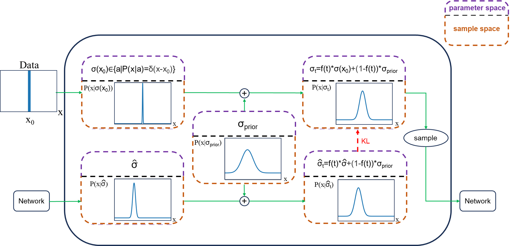

# MolPIF

MolPIF is a Parameter Interpolation Flow model for molecule generation. PIF is a novel generative modeling framework proposed in this work. MolPIF supports pocket-specific molecule generation for de novo and lead optimization tasks.

Technical details and evaluation results are provided in our paper:
* [MolPIF: A Parameter Interpolation Flow Model for Molecule Generation](http://arxiv.org/abs/2507.13762)


<p align="center">
    
</p>


## Table of Contents
- [MolPIF](#molpif)
  - [Table of Contents](#table-of-contents)
  - [Installation](#installation)
  - [Prepare Dataset](#prepare-dataset)
  - [Model weights](#model-weights)
  - [Training](#training)
  - [Inference](#inference)
  - [Evaluation](#evaluation)
  - [License](#license)
  - [Citation](#citation)


## Installation
You can build the environment (Default CUDA version is 12.4) using:
```
./setup_env.sh
```
To activate the environment, run:
```
conda activate MolPIF
```

## Prepare Dataset
We use the same data as [TargetDiff](https://github.com/guanjq/targetdiff/tree/main?tab=readme-ov-file#data). Data used for training / evaluating the model should be put in the `./data` folder by default, and accessible in the [data](https://drive.google.com/drive/folders/1j21cc7-97TedKh_El5E34yI8o5ckI7eK?usp=share_link) Google Drive folder.

To train the model from scratch, download the lmdb file and split file into data folder:
* `crossdocked_v1.1_rmsd1.0_pocket10_processed_final.lmdb`
* `crossdocked_pocket10_pose_split.pt`

To evaluate the model on the test set, download _and_ unzip the `test_set.zip` into `./data` folder. It includes the original PDB files that will be used in Vina Docking.


## Model weights
Download the pretrained checkpoint and config from [Google Drive](https://drive.google.com/drive/folders/1VBGnHyThNHpdaLgppOeKCKomwfL6oXde) whose filenames are `pretrained.ckpt` and `config.yaml`, and put it into `./weights` folder as follows. You can use the pretrained weight for inference.
- 📂 weights
    - 📂 checkpoints
        - 📄 pretrained.ckpt
    - ⚙️ config.yaml


## Training
To train MolPIF, firstly make sure you have prepared the dataset according to `Prepare Dataset`, and put it in the right folder. it is _optional_ to modify `./configs/default.yaml`. After this, you can run:
```
python train.py
```
And you will get the intermediate results and the checkpoints in `./logs`.


## Inference
As an example (Make sure checkpoints are put in the right folder), you can run :
```
python sample_for_pocket.py --ckpt_path weights/checkpoints/pretrained.ckpt
```
And you can get results in `./example/output_test/frag_part_filter`
&nbsp;

To generate molecules for de novo task targeting specified protein pocket, run:
```
python sample_for_pocket.py --protein_path $protein_path --ligand_path $ligand_path --ckpt_path $ ckpt_path --out_fn $out_fn
```
And you will get the results in `$out_fn`.

To generate molecules for lead optimization task targeting specified protein pocket (recommend using `pretrained_lead.ckpt`, which is trained with a larger $Pm$ and $Pam$), you need to specify an additional parameter `fix_index` to indicate the indices of the fixed atoms for the ligand, which can be determined using `./test/get_ligand_index.py`. Then run:
```
python sample_for_pocket.py --protein_path $protein_path --ligand_path $ligand_path --ckpt_path $ ckpt_path --out_fn $out_fn --fix_index $fix_index --attachment_atoms $attachment_atoms --min_add_num $min_add_num  
```
And you will get the results in `$out_fn`. (`$attachment_atoms` is used to specify the anchor, and remove atoms added at undesired positions)


## Evaluation
For regular properties (vina score, QED, SA, SE, etc), it is calculated upon sampling. The other evaluation procedure is the same as [MolCRAFT](https://github.com/AlgoMole/MolCRAFT) and [CBGBench](https://github.com/EDAPINENUT/CBGBench/tree/7a34993a8033b0a344ce24cb7c8fb40e5cb73b65); please refer to them for details. For tsne evaluation, you can use `./test/morgan_tsne.py`. For toy dataset evaluation, you can refer to `./toy/`.

Generated results `MolPIF_vina_docked.pt`, `MolPIF_metrics.json` and `MolPIF_geom.xlsx` can be downloaded from [Google Drive](https://drive.google.com/drive/folders/1VBGnHyThNHpdaLgppOeKCKomwfL6oXde)

## License
This project is licensed under the terms of the GPL-3.0 license.


## Citation
```
@article{jin2025molpif,
  title={MolPIF: A Parameter Interpolation Flow Model for Molecule Generation},
  author={Yaowei Jin, Junjie Wang, Wenkai Xiang, Duanhua Cao, Dan Teng, Zhehuan Fan, Jiacheng Xiong, Xia Sheng, Chuanlong Zeng, Mingyue Zheng, Qian Shi},
  journal={arxiv},
  year={2025}
}
```
